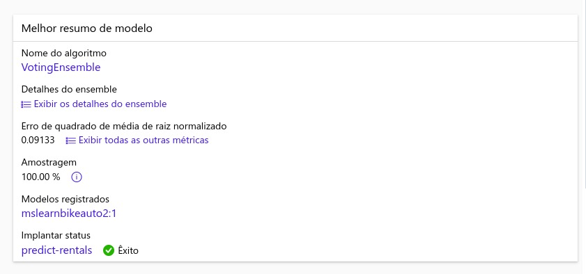

<h2>Atividade dio - Introdução a Machine Learning</h2>


## Configurações Básicas

- **Nome do Trabalho:** `mslearn-bike-automl`
- **Novo Nome do Experimento:** `mslearn-bike-rental`
- **Descrição:** Aprendizado de máquina automatizado para previsão de aluguel de bicicletas
- **Tags:** Nenhuma

## Tipo de Tarefa e Dados

### Tipo de Tarefa
- **Selecionar Tipo de Tarefa:** Regressão

### Conjunto de Dados
- **Tipo de Dados:** Tabular
- **Nome:** `bike-rentals`
- **Descrição:** Dados históricos de aluguel de bicicletas
- **Fonte de Dados:** De arquivos da web
- **URL da Web:** [https://aka.ms/bike-rentals](https://aka.ms/bike-rentals)
- **Pular Validação de Dados:** Não selecionar

#### Configurações
- **Formato do Arquivo:** Delimitado
- **Delimitador:** Vírgula
- **Codificação:** UTF-8
- **Cabeçalhos das Colunas:** Somente o primeiro arquivo possui cabeçalhos
- **Pular Linhas:** Nenhuma
- **Conjunto de Dados Contém Dados de Múltiplas Linhas:** Não selecionar

#### Esquema
- Incluir todas as colunas exceto Path
- Revisar os tipos detectados automaticamente

## Configurações da Tarefa

- **Tipo de Tarefa:** Regressão
- **Conjunto de Dados:** `bike-rentals`
- **Coluna-Alvo:** Aluguéis (inteiro)

### Configurações Adicionais
- **Métrica Principal:** Erro médio quadrático raiz normalizado
- **Explicar Melhor Modelo:** Não selecionado
- **Usar Todos os Modelos Suportados:** Não selecionado
- **Modelos Permitidos:** RandomForest, LightGBM
- **Limites:**
  - Máximo de Tentativas: 3
  - Máximo de Tentativas Concorrentes: 3
  - Máximo de Nós: 3
  - Limiar de Pontuação da Métrica: 0.085
  - Tempo Limite: 15
  - Tempo Limite da Iteração: 15
  - Ativar Término Antecipado: Selecionado

### Validação e Teste
- **Tipo de Validação:** Divisão treino-validação
- **Porcentagem de Dados de Validação:** 10
- **Conjunto de Dados de Teste:** Nenhum

## Computação
- **Selecionar Tipo de Computação:** Sem servidor
- **Tipo de Máquina Virtual:** CPU
- **Nível da Máquina Virtual:** Dedicado
- **Tamanho da Máquina Virtual:** Standard_DS3_V2*
- **Número de Instâncias:** 1

## Revisão do Melhor Modelo

Após a conclusão do trabalho de aprendizado de máquina automatizado, siga estas etapas para revisar o melhor modelo:

1. Na aba **Visão Geral** do trabalho de aprendizado de máquina automatizado, observe o resumo do melhor modelo. Destaque o nome do algoritmo.

   

   *Nota: Você pode ver uma mensagem sob o status "Aviso: Pontuação de saída especificada pelo usuário atingida...". Esta é uma mensagem esperada. Continue para a próxima etapa.*

2. Selecione o texto abaixo do nome do algoritmo para visualizar seus detalhes.

3. Na aba **Métricas**, selecione os gráficos de resíduos e de valores verdadeiros previstos, se ainda não estiverem selecionados.

4. Revise os gráficos que mostram o desempenho do modelo. O gráfico de resíduos mostra as diferenças entre os valores previstos e reais, enquanto o gráfico de valores verdadeiros previstos compara os valores previstos com os valores reais.

## Implantação e Teste do Modelo

Na aba "Modelo" para o melhor modelo treinado pelo seu trabalho de aprendizado de máquina automatizado, selecione "Implantar" e use a opção "Serviço da Web" para implantar o modelo com as seguintes configurações:

- **Nome:** predict-rentals
- **Descrição:** Prever aluguéis de bicicletas
- **Tipo de Computação:** Instância de Contêiner do Azure
- **Habilitar Autenticação:** Selecionado

Aguarde o início da implantação - isso pode levar alguns segundos. O status de implantação para o endpoint predict-rentals será indicado na parte principal da página como "Executando".

Aguarde até que o status de implantação mude para "Concluído". Isso pode levar de 5 a 10 minutos.

## Testar o Serviço Implantação

Agora você pode testar seu serviço implantado.

No Azure Machine Learning studio, no menu à esquerda, selecione "Endpoints" e abra o endpoint em tempo real predict-rentals.

Na página do endpoint em tempo real predict-rentals, visualize a aba "Teste".

Na seção "Dados de entrada para testar o endpoint", substitua o JSON de modelo pelo seguinte conjunto de dados de entrada:

```json
{
   "Inputs": { 
     "data": [
       {
         "day": 1,
         "mnth": 1,   
         "year": 2022,
         "season": 2,
         "holiday": 0,
         "weekday": 1,
         "workingday": 1,
         "weathersit": 2, 
         "temp": 0.3, 
         "atemp": 0.3,
         "hum": 0.3,
         "windspeed": 0.3 
       }
     ]    
   },   
   "GlobalParameters": 1.0
}
